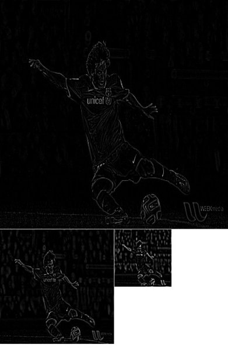

# 7 단원. 이미지 피라미드

### 목표

1. 이미지 피라미드를 배움

2. 이미지 피라미드를 통해 "사과렌지"라는 새로운 과일을 만듦

3. 함수 cv.pyrUp(), cv.pyrDown()를 배움

### 이론

보통 이미지를 다룰 땐 크기가 바뀌지 않는 환경에서 작업을 할 것이다. 하지만 어쩔 때엔 같은 사진이지만 다른 해상도의 사진들을 동시에 다뤄야할 때가 있을 수 있다. 
예를 들어 이미지에서 얼굴처럼 무언가를 찾을 때 그 오브젝트의 크기가 얼마일지 우리는 알 수가 없다. 
이 경우에 우리는 해상도는 다르지만 사진은 같은 여러 개의 사진들을 이용해 거기서 찾으려는 오브젝트를 찾으려고 할 것이다. 
이러한 사진들을 **이미지 피라미드**라고 부른다.(최고해상도부터 최저해상도까지 순서대로 쌓이는 모습이 피라미드와 유사하다고 해서 붙은 이름이다)  
이미지 피라미드에는 두 가지 종류가 있다.
1. 가우스 피라미드
2. 라플라스 피라미드

#### 가우스 피라미드
가우스 피라미드의 윗쪽 부분(저해상도)은 아래쪽 부분(고해상도)의 행과 열을 순서대로 제거하는 방식으로 만들어진다. 
그 다음 더 높은 층의 픽셀들은 바로 밑층에서 가우스 무게를 갖는 5개의 픽셀들을 통해 생성된다. 
이를 통해 MxN 이미지는 (M/2)x(N/2) 이미지가 된다. 즉, 본래 크기보다 4분의 1만큼 줄어든다. 이를 **옥타브**라고 부른다. 
이 방식대로 피라미드를 끝까지 쌓는다. 즉, 해상도가 줄어든다. 
비슷한 방식으로 피라미드를 거꾸로 쌓는다면 층이 높아질 수록 아래층보다 크기가 4배만큼 커질 것이다. 
가우스 피라미드는 함수 cv.pyrDown() 혹은 cv.pyrUp()을 통해 구현한다. 
다음은 이미지 피라미드의 예시다. 
<pre><code>img = cv.imread('messi5.jpg')
lower_reso = cv.pyrDown(higher_reso)
</code></pre>

이제 반대로 cv.pyrUp() 함수를 통해 피라미드를 거꾸로 세울 수 있다. 
<pre><code>higher_reso2 = cv.pyrUp(lower_reso)
</code></pre>
<code>higher_reso2</code>는 <code>higher_reso</code>와 같은 이미지가 아님을 명심해야한다. 한 번 해상도를 낮추면, 본래 이미지의 정보를 다 잃기 때문이다. 
위에 예시에서 생성된 가장 저해상도의 이미지부터 시작해서 피라미드를 거꾸로 세워서 생성한 세 번째 이미지는 다음과 같다. 

#### 라플라스 피라미드

라플라스 피라미드는 가우스 피라미드에서 파생된 피라미드다. 딱히 라플라스 피라미드만을 위한 함수는 없다. 
라플라스 피라미드 이미지는 마치 테두리만 있는 이미지와 비슷하다. 
이미지의 대부분의 원소들의 값은 0이다. 
보통 이미지 압축에 사용된다.  
라플라스 피라미드의 한 층은 가우스 피라미드의 해당 층과 그 윗층간의 변화량에 의해 생성된다. 
라플라스 피라미드는 다음과 같이 생겼다. 

### 피라미드를 이용한 이미지 합성 Image Blending

피라미드를 사용하는 분야 중 하나는 이미지 섞기Image Blending이다. 
예를 들어 이미지 두 개를 합쳐야하는 경우, 그냥 두 이미지를 막무가내로 섞어버리면 둘 사이의 연결 부분이 말끔하지 않아 어색할 것이다. 
이럴 때 피라미드를 이용해 이미지를 섞으면 이미지에 데이터를 많이 남기지 않으면서도 매끄럽게 섞인다. 
가장 흔한 예제가 바로 오렌지와 사과를 섞는 예제다. 
우선 직접 사진으로 확인해보도록 하자. 

다음 [링크](http://pages.cs.wisc.edu/~csverma/CS766_09/ImageMosaic/imagemosaic.html)를 통해 이미지 블렌딩과 라플라스 피라미드와 같은 개념을 전체적으로 이해하도록 하자. 
요약하자면 다음과 같다:

1. 사과의 오렌지 이미지를 불러온다
2. 사과와 오렌지의 가우스 피라미드를 생성한다. (본 예제에선 6층짜리로 생성했다)
3. 가우스 피라미드로부터 라플라스 피라미드를 생성한다.
4. 이제 사과의 왼쪽부분과 오렌지의 우측부분을 각 층마다 섞어준다.
5. 둘을 섞은 이 피라미드로부터 원본 이미지를 재생성한다.